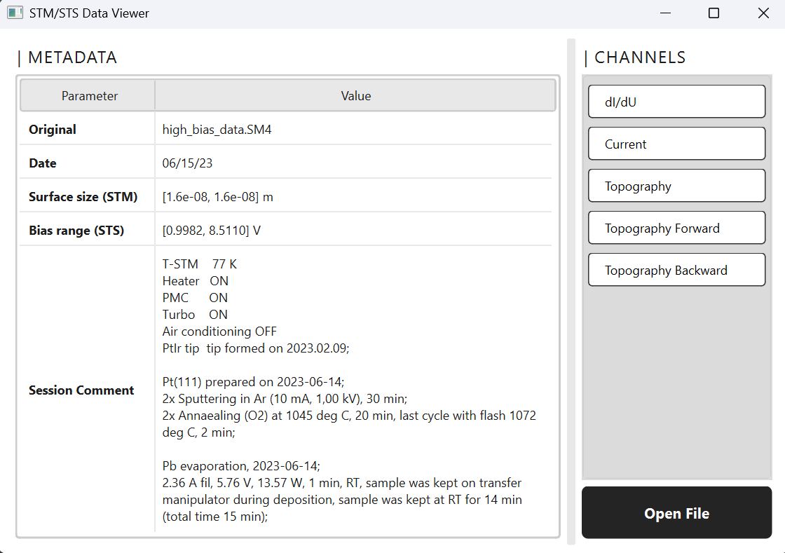
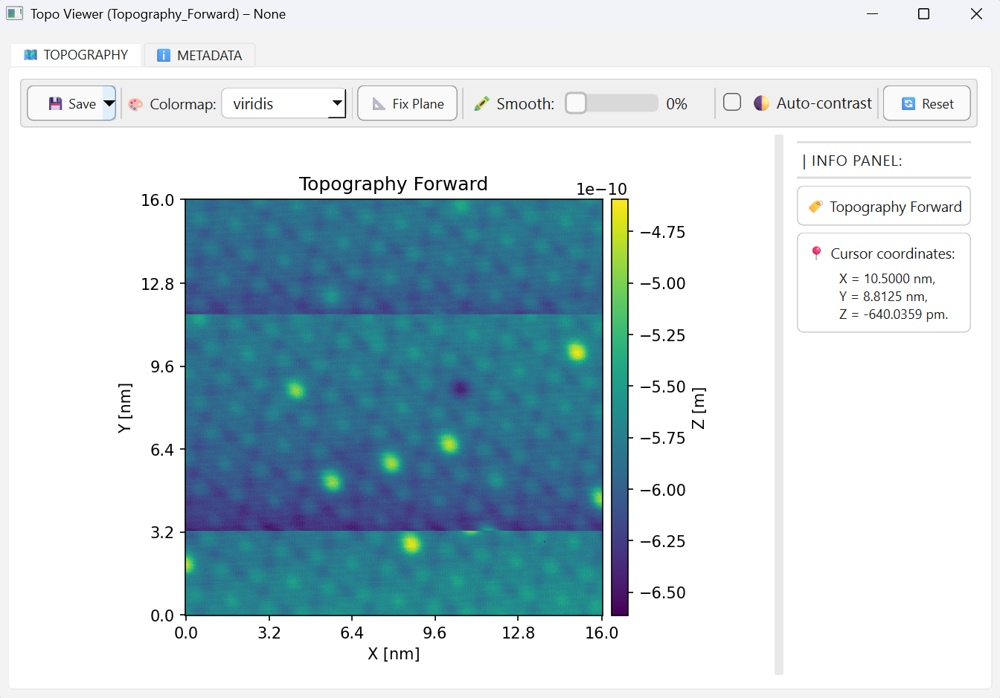
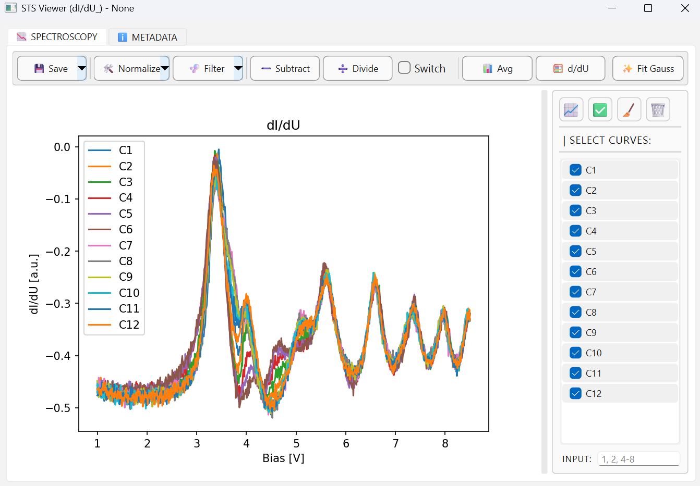
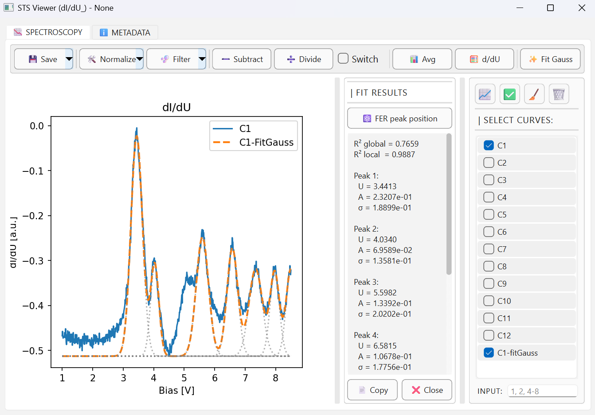
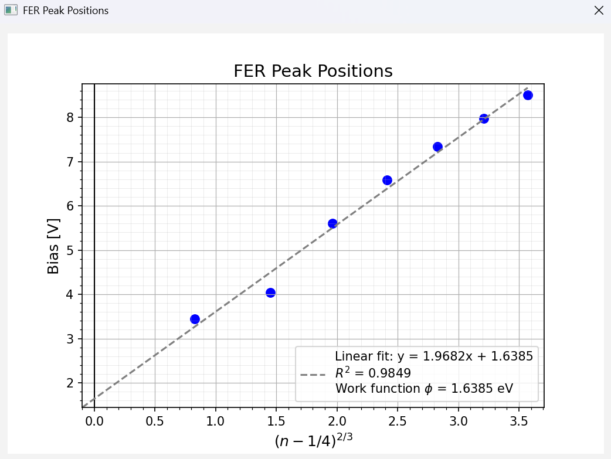
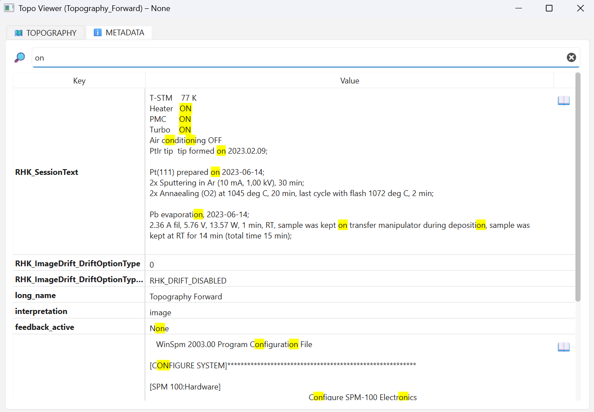

# Design and Implementation of a Graphical User Interface in Python for the Analysis and Visualization of STM/STS Spectroscopic Data

A Python-based GUI tool for the analysis, processing, and visualization of scanning tunneling spectroscopy (STS) data, with a particular focus on high-bias spectroscopy.


## Background

This project focuses on the analysis of data obtained from scanning tunneling microscopy (STM) and scanning tunneling spectroscopy (STS), with particular emphasis on high-bias spectroscopy. The main objective was to design and implement a Python-based graphical user interface that supports efficient and interactive analysis of spectroscopic data.


## Features

The developed GUI tool provides a comprehensive set of tools for the analysis of STM/STS spectroscopic data, including:

- Loading and parsing measurement files in `.sm4` and `.csv` formats using a modular data parser.
- Interactive visualization of spectroscopic curves and topographic channels.
- A collection of signal processing tools, including:
  - normalization,
  - filtering,
  - subtraction,
  - division,
  - averaging,
  - numerical differentiation.
- Automatic detection of local maxima in spectroscopic curves.
- Gaussian curve fitting for each detected peak, enabling the extraction of characteristic parameters such as peak position, amplitude, and standard deviation.
- Automatic estimation of the work function of the investigated material based on fitted peak parameters.
- Display and searchable view of metadata associated with each measurement channel.
- Basic data validation and safety mechanisms to prevent invalid operations (e.g. division by zero).

The software was tested and validated using real experimental data, confirming its correctness and practical usefulness in quantitative STM/STS data analysis.


## Requirements

- Python 3.11 or newer
- Required Python packages are listed in `requirements.txt`


## Installation

Clone the repository and navigate to the project directory:

```bash
git clone https://github.com/SofiaDmytrenko/GUI-STM-STS
```
``` bash
cd GUI-STM-STS
```

Create a virtual environment:
``` bash
python -m venv .venv
```
Activate the virtual environment:

On Linux / macOS:
``` bash
source .venv/bin/activate
```

On Windows:
``` bash
.venv\Scripts\activate
```


Install the required dependencies:
``` bash
pip install -r requirements.txt
```


## Usage

After installing the requirements and activating the virtual environment, run the GUI tool using:
```bash
python main.py
```

> [!NOTE]
> The program is intended to be run from a Python IDE (e.g., PyCharm, VS Code) or from the terminal. Make sure the virtual environment is active before running the script.

### Loading and Visualizing Data

Click the "Open File" button and select a measurement file in .sm4 or .csv format.
Available measurement channels will be displayed.
<p align="center">
  
</p>

Select a channel to view its topography or spectroscopic curves.
<table>
  <tr>
    <td align="center">
      
      <p>Topo Viewer</p>
    </td>
    <td align="center">
      
      <p>STS Viewer</p>
    </td>
  </tr>
</table>

Apply the built-in signal processing tools to the curves:
- normalization
- filtering
- subtracting
- dividing
- averaging
- differentiating

<table>
  <tr>
    <td align="center">
      
      <p>FitGauss</p>
    </td>
    <td align="center">
      
      <p>FER peak positions</p>
    </td>
  </tr>
</table>

Use the automatic peak detection and Gaussian fitting module to extract parameters such as:
- peak position
- amplitude
- standard deviation (σ)
- work function of the material

### Viewing Metadata
Metadata for each measurement channel is available within the GUI and can be searched or filtered as needed.
<p align="center">
  
</p>


## Project structure
<pre>
GUI-STS/
├── gui/                                  # Main GUI folder containing modules that define windows, toolbars, viewers, and layouts.
|    ├── channel_viewers/
|    |   ├── topo_viewer.py               # Module responsible for displaying STM topography images.
|    |   └── sts_viewer_folder/ 
|    |         ├── sts_viewer.py          # Main module for analyzing STS curves.
|    |         ├── sts_toolbar.py         # Provides buttons for STS signal processing functions.
|    |         ├── sts_processing.py      # Signal processing functions.
|    |         └── fit_gauss.py           # Peak detection and Gaussian fitting.
|    ├── helpers/
|    |   ├── metadata_tab.py              # Module for displaying and searching metadata associated with measurement channels.
|    |   └── styles.py                    # Defines visual styles, themes, and GUI element appearance for consistency.
|    ├── data_parser.py                   # Module for reading `.sm4` and `.csv` files
|    └── main_window.py                   # First window displayed; allows to open files, select channels and view file metadata.
├── main.py                               # Entry point to launch the GUI.
├── requirements.txt                      # Python dependencies.
├── .github                               # GitHub-specific configuration, workflows or actions.
├── .gitignore                            # Files and folders to ignore in version control
├── README.md                             # Project documentation
└── images/                               # Folder for screenshots used in the README.
    ├── main_window.png
    ├── sts_viewer.png
    ├── topo_viewer.png
    ├── fit_gauss.png
    ├── fer_peaks.png
    └── metadata_tab.png
</pre>

## Testing

This project does not include automated tests.  
The functionality was validated manually using experimental STM/STS data.


## Limitations

- Supported file formats: `.sm4` and `.csv`
- Currently, only **Gaussian fitting** is implemented; other theoretical functions (Lorentzian, exponential, etc.) are not supported. 
- When saving data in `.csv` format, **only one measurement channel can be saved at a time**.  
- **Normalization cannot be performed correctly** on `.csv` data if the corresponding I–V curve ("Current" channel) is missing, since normalization requires the current measurements for accurate processing.
